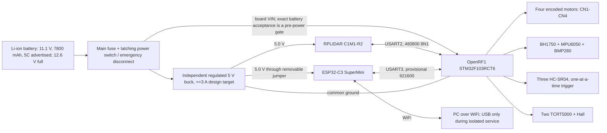

# OpenRF1 Rover Assembly Wiring Plan

This is the master harness plan for the STM32F103RCT6 OpenRF1 rover. It combines
the OpenRF1 schematic dated 2024-07-01, the vendor motor/encoder examples, the
verified C1 harness profile, and the existing isolated sensor bring-up plans.

For on-vehicle assembly, use the Chinese field checklist
[`openrf1_rover_wiring_plan_zh.md`](openrf1_rover_wiring_plan_zh.md) together
with this engineering source of truth.

This document is build-ready. The user has approved the seller-documented
11.1 V Li-ion pack as the direct OpenRF1 VIN source on the basis that the
installed components are wide-voltage parts. Battery polarity, BMS current
limits, four-motor stall current, main fuse value, physical connector
orientation, and installed divider voltages remain manual pre-power checks.

The user subsequently reported that the complete vehicle was assembled to this
plan. That report does not verify any manual pre-power check or authorize
flashing, serial access, motor power, or motion. Continue from
[`near_term_vehicle_bringup_handoff.md`](near_term_vehicle_bringup_handoff.md).

## Status Legend

- `AUTHORITATIVE_VENDOR_DOCUMENTED`: directly shown by the OpenRF1 schematic.
- `VENDOR_SOFTWARE_DOCUMENTED`: directly used by the supplied OpenRF1 example.
- `SELLER_DOCUMENTED`: visible in the supplied exact-variant product image; not
  a physical measurement or manufacturer datasheet.
- `CALCULATED_FROM_SELLER_DATA`: arithmetic from advertised values; not a
  measured capability or component rating.
- `MANUAL_EVIDENCE_VERIFIED`: already exercised in an isolated repository record.
- `DESIGN_LOCKED`: selected by this project; firmware or physical validation may
  still be required.
- `MANUAL_ACTION_REQUIRED`: must be measured or checked before energizing.
- `UNVERIFIED`: must not be treated as a measured hardware result.

## Master Topology



Power the C1 and ESP32 from the independent 5 V buck, not from UART connector
pin 1. Leave H5 pin 1 and H6 pin 1 disconnected in the final harness. This
keeps C1 startup current and ESP32 radio transients off the OpenRF1 sensor rail.
All grounds must still be common.

Do not connect ESP32 USB while its external 5 V jumper is installed.

## OpenRF1 Connector Index

Pin numbers below are electrical pin numbers. Never infer pin 1 from a photo or
from left-to-right order. Locate the connector key, pin-1 mark, or confirm it by
continuity with power removed.

| Connector | Purpose | Pinout | Status |
| --- | --- | --- | --- |
| CN1 | Motor/encoder C, project rear-left | 1 OUT2, 2 5V, 3 PA0/TIM5_CH1, 4 PA1/TIM5_CH2, 5 GND, 6 OUT1 | AUTHORITATIVE_VENDOR_DOCUMENTED |
| CN2 | Motor/encoder A, project front-left | 1 OUT2, 2 5V, 3 PA6/TIM3_CH1, 4 PA7/TIM3_CH2, 5 GND, 6 OUT1 | AUTHORITATIVE_VENDOR_DOCUMENTED |
| CN3 | Motor/encoder D, project rear-right | 1 OUT2, 2 5V, 3 PA15/TIM2_CH1, 4 PB3/TIM2_CH2, 5 GND, 6 OUT1 | AUTHORITATIVE_VENDOR_DOCUMENTED |
| CN4 | Motor/encoder B, project front-right | 1 OUT2, 2 5V, 3 PB6/TIM4_CH1, 4 PB7/TIM4_CH2, 5 GND, 6 OUT1 | AUTHORITATIVE_VENDOR_DOCUMENTED |
| CN5 | Board power breakout | 1 5V, 2 GND, 3 3.3V, 4 GND | AUTHORITATIVE_VENDOR_DOCUMENTED |
| CN6 | Ultrasonic 1 | 1 5V, 2 GND, 3 PA5/TRIG, 4 PA4/ECHO | AUTHORITATIVE_VENDOR_DOCUMENTED |
| H3 | Six protected servo-signal GPIOs | 1 PB9, 2 PB8, 3 PB5, 4 PB4, 5 PD2, 6 PC11; each has board 1 kOhm series resistance | AUTHORITATIVE_VENDOR_DOCUMENTED |
| H4 | 2x4 software-I2C header | 1/2 5V, 3/4 GND, 5/6 PB1/SCL, 7/8 PC3/SDA | AUTHORITATIVE_VENDOR_DOCUMENTED |
| H5 | USART2 user port | 1 5V, 2 GND, 3 PA2/TX2, 4 PA3/RX2 | AUTHORITATIVE_VENDOR_DOCUMENTED |
| H6 | USART3 Bluetooth port | 1 5V, 2 GND, 3 PB11/RX3, 4 PB10/TX3 | AUTHORITATIVE_VENDOR_DOCUMENTED |
| Tracking 6P | Ground/Hall inputs | 1 GND, 2 PC14/X4 unused, 3 PB0/X3, 4 PC5/X2, 5 PC4/X1, 6 5V | AUTHORITATIVE_VENDOR_DOCUMENTED |

## Four Motor Harnesses

Use the same convention on all four XH2.54-6P harnesses. The user reports that
the encoder accepts 3.3-5 V and that its output-high level follows its supply.
Because the output topology is still unknown, do not use the connector's 5 V
encoder supply. Leave connector pin 2 unpopulated and feed each blue encoder-VCC
wire from CN5 pin 3 / 3.3 V instead. Add one 10 kOhm pull-up to 3.3 V on every
A and B signal. This is safe for an open-drain output and benign for a push-pull
output.

Do not reverse individual motor wires to compensate for chassis orientation;
preserve identical harnesses and apply direction signs in firmware after the
wheels-off-ground test.

| Connector pin | Board signal | JGB37-520 wire | Harness rule |
| ---: | --- | --- | --- |
| 1 | AT8236 OUT2 | White, Motor- | DESIGN_LOCKED |
| 2 | Board encoder 5 V | No wire; leave cavity insulated | DESIGN_LOCKED safety isolation |
| 3 | Encoder channel A | Yellow, encoder A; 10 kOhm pull-up to 3.3 V | DESIGN_LOCKED |
| 4 | Encoder channel B | Green, encoder B; 10 kOhm pull-up to 3.3 V | DESIGN_LOCKED |
| 5 | Encoder GND | Black, encoder GND | DESIGN_LOCKED from motor wire definition |
| 6 | AT8236 OUT1 | Red, Motor+ | DESIGN_LOCKED |

Route all four blue encoder-VCC wires to a 3.3 V distribution point fed from
CN5 pin 3. Route their grounds to common GND. Do not bridge this 3.3 V encoder
rail to motor-connector pin 2.

| Wheel | Vendor ID | Connector | PWM input | Direction input | Encoder timer |
| --- | --- | --- | --- | --- | --- |
| Front-left | A / L1 | CN2 | PC7 / TIM8_CH2 | PA11 | TIM3 on PA6/PA7 |
| Front-right | B / R1 | CN4 | PC9 / TIM8_CH4 | PC10 | TIM4 on PB6/PB7 |
| Rear-left | C / L2 | CN1 | PC6 / TIM8_CH1 | PA8 | TIM5 on PA0/PA1 |
| Rear-right | D / R2 | CN3 | PC8 / TIM8_CH3 | PA12 | TIM2 on PA15/PB3 |

The front/rear interpretation of `1` and `2` is project `DESIGN_LOCKED` from
the vendor L1/R1/L2/R2 labels and movement vectors. Confirm it with wheels off
the ground before installing the mecanum wheels permanently.

The vendor example uses TIM8 PWM1, active-high output, 72 MHz system clock,
prescaler 1, and period 2000, giving approximately 17.99 kHz. Its zero target
does not implement an independent emergency stop. Final rover firmware must
provide explicit brake, coast, controller-reset, and command-timeout behavior.

User-reported JGB37-520 baseline: 6-12 V, 0.36 A no-load current, 3.2 A stall
current, 30:1 reduction, and 330 rpm no-load output speed. Four motors therefore
represent approximately 1.44 A combined no-load current and 12.8 A theoretical
simultaneous stall current before board current limiting or protection. The
nominal encoder count is 11 A cycles and 11 B cycles per motor-shaft revolution,
330 A cycles per output revolution at 30:1, or 1320 quadrature counts per output
revolution with x4 decoding.

## Shared I2C Harness

Use a small distribution board or soldered branch harness. SCL, SDA, and GND
are shared. Module VCC pins are not all tied together.

| Module pin | Destination | Status |
| --- | --- | --- |
| BH1750 VCC | H4 pin 1 or 2, 5 V | MANUAL_EVIDENCE_VERIFIED for the GY-302 module |
| BH1750 GND/SCL/SDA | H4 GND / PB1 / PC3 | MANUAL_EVIDENCE_VERIFIED |
| BH1750 ADDR | GND, address 0x23 | MANUAL_EVIDENCE_VERIFIED |
| MPU6050 VCC | H4 pin 1 or 2, 5 V | MANUAL_EVIDENCE_VERIFIED for isolated GY-521 bring-up |
| MPU6050 GND/SCL/SDA | H4 GND / PB1 / PC3 | MANUAL_EVIDENCE_VERIFIED in isolation |
| MPU6050 AD0 | GND, address 0x68 | MANUAL_EVIDENCE_VERIFIED in isolation |
| MPU6050 INT/XDA/XCL/FSYNC | Leave disconnected | DESIGN_LOCKED polling configuration |
| BMP280 VCC and CSB | CN5 pin 3, 3.3 V | PHYSICAL_EVIDENCE_VERIFIED in isolation |
| BMP280 GND and SDO | GND | PHYSICAL_EVIDENCE_VERIFIED, address 0x76 |
| BMP280 SCL/SDA | H4 PB1 / PC3 | PHYSICAL_EVIDENCE_VERIFIED in isolation |

Do not add more pull-ups before measuring the assembled bus. The board already
has 10 kOhm pull-ups to 3.3 V and the modules may add parallel pull-ups.

## Three Ultrasonic Harnesses

The user confirmed the current demo signal mapping on 2026-08-02. It uses all
six H3 signal pins and supersedes the earlier CN6-first proposal for this demo
target only.

| Sensor | Current mounting role | TRIG | ECHO | Status |
| --- | --- | --- | --- | --- |
| ultrasonic_1 | Left | H3 pin 1, PB9 | H3 pin 2, PB8 | USER_CONFIRMED_CURRENT_DEMO_MAPPING |
| ultrasonic_2 | Centre | H3 pin 3, PB5 | H3 pin 4, PB4 | USER_CONFIRMED_CURRENT_DEMO_MAPPING |
| ultrasonic_3 | Right | H3 pin 5, PD2 | H3 pin 6, PC11 | USER_CONFIRMED_CURRENT_DEMO_MAPPING |

Trigger only one module at a time; do not fire the three sensors simultaneously.
The user reports all three ECHO signals are directly connected without dividers
and obstacle avoidance works. This is USER_REPORTED_OPERATIONAL_DIRECT_ECHO,
not electrical acceptance. Actual ECHO-high voltages at PB8, PB4, and PC11 and
the exact input-path limits remain UNVERIFIED.

The earlier conservative divider design remains available if measurements show
it is required:

```text
HC-SR04 ECHO ---- 10 kOhm ----+---- OpenRF1 ECHO input
                              |
                           15 kOhm
                              |
                             GND
```

Use 5 percent tolerance or better. The divider output is approximately 0.6 of
the module ECHO voltage. Measure the node before attaching it to OpenRF1.

## Ground And Hall Harness

Power the two TCRT5000 modules from 3.3 V, not from tracking-connector pin 6.
Power the Hall module from 5 V and divide its S output before PB0.

| Module signal | Destination | Status |
| --- | --- | --- |
| Left TCRT VCC/GND/OUT | CN5 pin 3 / common GND / tracking pin 5 PC4/X1 | TCRT signal path MANUAL_EVIDENCE_VERIFIED in isolation |
| Right TCRT VCC/GND/OUT | CN5 pin 3 / common GND / tracking pin 4 PC5/X2 | TCRT signal path MANUAL_EVIDENCE_VERIFIED in isolation |
| Hall + / - | CN5 pin 1 5V / common GND | DESIGN_LOCKED |
| Hall S | 10 kOhm / 15 kOhm divider output to tracking pin 3 PB0/X3 | DESIGN_LOCKED; voltage and polarity unverified |
| Tracking pin 2 PC14/X4 | No connection | DESIGN_LOCKED |
| Tracking pin 6 5V | No connection for TCRT modules | DESIGN_LOCKED |

Use the same divider topology shown for HC-SR04 ECHO. Measure Hall S in both
magnetic states, then measure the divided node. Do not connect PB0 if the node
can exceed 3.3 V.

## RPLIDAR C1 To USART2

The C1 is powered by the independent regulated 5 V buck. H5 pin 1 is left
disconnected.

| C1 wire | C1 function | Destination |
| --- | --- | --- |
| Red | 5 V | Independent regulated 5 V output |
| Black | GND | Common ground and H5 pin 2 |
| Yellow | C1 TX | H5 pin 4, PA3/RX2 |
| Green | C1 RX | H5 pin 3, PA2/TX2 |
| Unused fifth position | None | Leave disconnected |

Use 460800 baud, 8 data bits, no parity, 1 stop bit. Do not connect a USB UART
adapter to the same C1 TX/RX pair while OpenRF1 is connected.

## ESP32-C3 To USART3

The ESP32 is powered by the independent 5 V buck through a removable jumper.
H6 pin 1 is left disconnected.

| ESP32-C3 pin | Destination |
| --- | --- |
| 5V | Independent 5 V output through removable jumper |
| GND | Common ground and H6 pin 2 |
| GPIO21 TX | H6 pin 3, PB11/RX3 |
| GPIO20 RX | H6 pin 4, PB10/TX3 |

The proposed STM32 link is 921600 baud and remains physically unverified. No
logic-level converter is required for the 3.3 V UART signals. Remove external
5 V before plugging USB into the ESP32.

The exact board is user-confirmed as ESP32-C3 SuperMini, and GPIO21 TX / GPIO20
RX are user-confirmed for this UART link. The ESP32-C3 SoC provides two hardware
UARTs and GPIO-matrix routing. GPIO2, GPIO8, and GPIO9 are strapping pins and are
not selected for this link. SuperMini clones can use different LDO parts, so the
claimed AMS1117-class 500 mA rating remains provisional; design continuous load
from the physical board's thermal behavior, not the nominal LDO headline.

## C1 Startup Contract

- Keep the verified 5 V design allowance of approximately 800 mA for startup,
  230 mA typical operation, and 260 mA maximum normal operation. A 300 mA source
  is not accepted as the startup supply rating.
- Use 460800 baud, 8N1, 3.3 V TTL. OpenRF1 and C1 UART logic can connect directly.
- On startup, establish transport, request health, reject a reported fault, then
  send standard SCAN (`0xA5 0x20`) and validate the response descriptor before
  accepting sample bytes. RESET is a recovery action, not a mandatory command
  before every scan.
- The official SLAMTEC SDK repository lists C1 support in SDK v2.1.0. Production
  firmware may reuse the protocol, but does not need to embed the desktop SDK.

## Power Harness And Protection

Seller-documented battery and charger baseline. The source images and hashes are
recorded in [`battery_evidence.md`](../evidence/hardware/battery/battery_evidence.md).

| Field | Value | Status |
| --- | --- | --- |
| Chemistry | Li-ion | SELLER_DOCUMENTED |
| Nominal voltage | 11.1 V | SELLER_DOCUMENTED |
| Capacity | 7800 mAh / 7.8 Ah | SELLER_DOCUMENTED; not capacity-tested |
| Advertised discharge rate | 5C | SELLER_DOCUMENTED; not a confirmed BMS limit |
| Nominal stored energy | 86.58 Wh | CALCULATED_FROM_SELLER_DATA |
| Advertised-rate current | 39 A | CALCULATED_FROM_SELLER_DATA; not measured and not a confirmed continuous rating |
| Full-charge voltage | 12.6 V | SELLER_DOCUMENTED; multimeter verification required |
| Advertised dimensions | 70 x 55 x 23 mm | SELLER_DOCUMENTED; verify actual fit |
| Battery connector | DC 5.5 x 2.5 mm male barrel | SELLER_DOCUMENTED; polarity UNVERIFIED |
| BMS continuous/peak discharge current | Unknown | MANUAL_ACTION_REQUIRED |
| Charger | 110-240 VAC 50/60 Hz in; 12.6 V/1 A out; DC 5.5 x 2.5 mm female; 100 cm cable | SELLER_DOCUMENTED; polarity/regulation UNVERIFIED |

The AT8236 motor driver recommends a 5.5-30 V VM range, and the TPS54331 board
regulator supports a 3.5-28 V input range. These component ratings do not by
themselves approve the complete OpenRF1 board or motors at a fully charged
12.6 V. The schematic labels the board input as 12 V, contains 16 V-rated input
parts, and the current motor task data states a 12 V maximum. Motor switching
and regenerative transients also reduce the available margin to 16 V.

Direct connection from the pack, through the main fuse and latching disconnect,
to OpenRF1 VIN is `USER_APPROVED_DESIGN`. This records the selected topology; it
does not claim a measured full-charge voltage, transient margin, or current
capacity. The 39 A advertised-rate calculation is not permission to select a
39 A fuse or wiring. First power-on must still use the staged procedure with motors
disconnected, followed by one raised wheel at a time. Limiting PWM duty is not
a substitute for verifying current and transient behavior.

The 12.6 V/1 A charger is charge-only. Disconnect the battery from the rover before charging. Never connect USB/external supplies to the same powered system
during charging, and never use this charger as the rover's operating supply.

Component references: [AT8236 datasheet](https://atta.szlcsc.com/upload/public/pdf/source/20230410/6ECF1F3FBCD600EE00816F0DF148575A.pdf)
and [Texas Instruments TPS54331 datasheet](https://www.ti.com/lit/ds/symlink/tps54331.pdf).

1. Battery positive goes through a main fuse and latching disconnect before it
   branches to OpenRF1 VIN and the independent 5 V buck.
2. Battery negative, OpenRF1 GND/PGND, buck ground, C1 ground, ESP32 ground, and
   sensor grounds join at the power distribution point.
3. Motor current wiring and the battery loop are routed separately from I2C,
   UART, encoder, and ECHO wiring.
4. Add strain relief at the battery, OpenRF1 input, motor connectors, and C1.
5. Do not select the main fuse or motor-wire gauge until one-motor stall current
   and four-motor worst-case current have been measured.

Record the BMS continuous/peak current, measured barrel polarity, measured fully
charged voltage, and selected fuse rating before power-on.

## Parts Needed For This Harness

- Four XH2.54-6P motor/encoder harnesses.
- PH2.0 4-pin harnesses for CN5 and CN6, with pin order checked against the
  actual keyed connector.
- One 6-pin tracking harness.
- 2.54 mm female leads or keyed housings for H3, H4, H5, and H6.
- Eight 10 kOhm encoder A/B pull-ups and one 10 kOhm / 15 kOhm Hall divider,
  5 percent or better. Keep three additional divider pairs or suitable level
  shifters available if measured HC-SR04 ECHO levels require protection.
- One regulated 5.0 V buck supply with at least a 3 A design target and adequate
  transient response; validate output under load before connecting C1/ESP32.
- Main fuse holder, branch protection, latching power switch or emergency
  disconnect, distribution terminals, heat-shrink, labels, and strain relief.
- One DC 5.5 x 2.5 mm female battery-mating adapter with verified polarity; its
  rover-side plug must be selected from the actual OpenRF1 power jack, not by
  assuming the two barrel sizes match.
- A removable ESP32 5 V jumper.

## Mandatory Pre-Power Sequence

1. Confirm the physical board matches the 2024-07-01 schematic and identify pin
   1 on every connector.
2. Keep the battery and charger disconnected. Check every VCC-to-GND branch for
   a short. Meter the battery and charger barrel centre/sleeve polarity separately.
3. Check all four motor harnesses pin-by-pin; confirm no motor lead reaches an
   encoder signal or encoder supply pin. Confirm connector pin 2 is unpopulated,
   every blue encoder wire reaches only 3.3 V, and all eight A/B pull-ups reach
   only 3.3 V.
4. Measure the Hall 10 kOhm / 15 kOhm divider in circuit. Before accepting the
   current direct ultrasonic wiring, measure ECHO-high at PB8, PB4, and PC11
   against the exact board input limits; install protection if required.
5. Disconnect motors, C1, ESP32, and sensors. Power only the regulator/board and
   measure 5 V, 3.3 V, and polarity.
6. Measure the independent 5 V buck at no load and under a dummy load. C1 supply
   must remain within 4.8-5.2 V with acceptable ripple.
7. Add one subsystem at a time in the repository bring-up order. Never attach
   all devices for the first power-on.
8. Before connecting Hall S, measure its raw and divided high levels and confirm
   the divided node does not exceed 3.3 V. Treat direct HC-SR04 ECHO electrical
   acceptance as pending until the three current paths have equivalent voltage
   evidence.
9. Test one motor at a time with wheels clear of the bench. Confirm connector,
   wheel position, motor sign, encoder sign, brake, command timeout, and emergency
   stop before testing four-wheel motion.
10. Install mecanum wheels only after FL/FR/RL/RR mapping and roller orientation
    have been checked.

## Remaining Power-On Gates

The harness can be built now. Full-rover power-on remains blocked until these
values are recorded:

- measured fully charged voltage, connector polarity, and BMS continuous/peak
  current rating;
- one-motor stall current and selected main fuse/wire gauge;
- physical board revision and connector pin-1 orientation;
- installed divider resistance and output voltage measurements;
- final FL/FR/RL/RR motor and encoder signs;
- firmware support for ultrasonic 2/3 on PB9/PB8 and PD2/PC11;
- shared-I2C operation, USART2 C1 operation, and USART3 ESP32 operation;
- geometry tolerance and repeatability for the supplied 79 mm wheel diameter,
  190 mm wheelbase, and 217 mm track width;
- mecanum roller handedness and controlled motion confirmation.

No hardware access, serial-port access, flashing, or physical measurement was
performed while preparing this plan.
