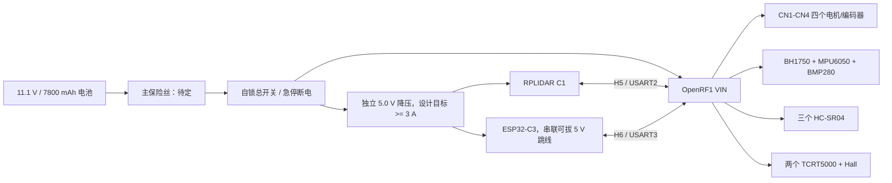

# OpenRF1 火星车装车接线施工版

版本：2026-07-23

适用硬件：OpenRF1（STM32F103RCT6）、四个 JGB37-520 霍尔编码电机、
三个 HC-SR04、两个 TCRT5000、一个 Hall 模块、BH1750、BMP280、
MPU6050、RPLIDAR C1M1-R2、ESP32-C3 SuperMini。

本文件用于现场装车。参数依据和状态说明以
[`openrf1_rover_wiring_plan.md`](openrf1_rover_wiring_plan.md) 为准。

用户现已报告全车按本方案完成装配，但尚未提交新的照片、通断、轨电压、
保护配置或运行证据，因此不能把“装好”升级为“电气验收通过”。近期软件
交接和下一步边界见
[`near_term_vehicle_bringup_handoff.md`](near_term_vehicle_bringup_handoff.md)。

## 先看结论

- 全车装配已由用户报告完成；下一步是断电复核、测量和分级验证。
- 现在不能直接给整车通电。
- 电池圆孔插头极性、BMS 连续/峰值电流、主保险丝、主回路线径、板端
  电源插头规格和全部 5 V 输入分压后的电压尚未实测。
- HC-SR04 2/3、真实电机 PWM/编码器、ESP32 通信和整车联合固件尚未
  完成，不得把“接好线”理解为“软件已经能控制整车”。

## 一眼总图



所有 GND 最终共地。电机主回路与 UART、I2C、编码器、ECHO 信号线分开
走线。所有接头两端都贴同名标签，不依靠线色猜功能。

## 装车前材料

| 数量 | 材料 | 用途 |
| ---: | --- | --- |
| 4 | XH2.54-6P 电机/编码器线束 | CN1-CN4 |
| 2 | PH2.0-4P 线束 | CN5、CN6 |
| 1 | 与 Tracking 6P 匹配的线束 | TCRT/Hall |
| 4 组 | 2.54 mm H3/H4/H5/H6 连接线 | 超声、I2C、C1、ESP32 |
| 12 | 10 kOhm，建议 1% | 4 个分压上臂 + 8 个编码器上拉 |
| 4 | 15 kOhm，建议 1% | 4 个分压下臂 |
| 1 | 稳压 5.0 V 降压模块，设计目标至少 3 A | C1、ESP32 独立供电 |
| 1 | DC 5.5 x 2.5 mm 母头电池转接线 | 与电池公头配合；先测极性 |
| 1 | 主保险丝座，保险丝暂不装 | 额定值待电流测量后选 |
| 1 | 自锁总开关或可快速断电开关 | 主电源断开 |
| 1 | 5 V 可拔跳线/开关 | ESP32 外部 5 V 隔离 |
| 若干 | 分电端子、热缩管、扎带、号码管、应力释放 | 固定和防错 |

主保险丝、主电机线径和 OpenRF1 板端电源插头在实测前不要定型购买。

## 连接器索引

针脚号是电气针脚号，不是照片中的左右顺序。必须按外壳卡扣、板上
Pin 1 标记或断电通断关系确认。

| 接口 | 针脚定义 |
| --- | --- |
| CN1 | 1 OUT2，2 5V，3 PA0/A，4 PA1/B，5 GND，6 OUT1 |
| CN2 | 1 OUT2，2 5V，3 PA6/A，4 PA7/B，5 GND，6 OUT1 |
| CN3 | 1 OUT2，2 5V，3 PA15/A，4 PB3/B，5 GND，6 OUT1 |
| CN4 | 1 OUT2，2 5V，3 PB6/A，4 PB7/B，5 GND，6 OUT1 |
| CN5 | 1 5V，2 GND，3 3.3V，4 GND |
| CN6 | 1 5V，2 GND，3 PA5/TRIG，4 PA4/ECHO |
| H3 | 1 PB9，2 PB8，3 PB5，4 PB4，5 PD2，6 PC11 |
| H4 | 1/2 5V，3/4 GND，5/6 PB1/SCL，7/8 PC3/SDA |
| H5 | 1 5V，2 GND，3 PA2/TX2，4 PA3/RX2 |
| H6 | 1 5V，2 GND，3 PB11/RX3，4 PB10/TX3 |
| Tracking 6P | 1 GND，2 PC14/X4 不用，3 PB0/X3，4 PC5/X2，5 PC4/X1，6 5V |

## 第 1 步：只安装，不接电池

1. 固定 OpenRF1、降压模块、保险丝座、总开关和分电端子。
2. 固定四个电机并标记 `FL`、`FR`、`RL`、`RR`，暂不永久锁定麦克纳姆轮方向。
3. 固定传感器，沿用中性编号 `ultrasonic_1..3`、`tcrt5000_1..2`、
   `hall_1`、`c1_1`，完成实测后再写前/左/右等最终角色。
4. 电池、充电器、USB 和所有外部电源保持断开。

## 第 2 步：主电源骨架

```text
电池正极 -> 主保险丝座 -> 自锁总开关 -> 分成两路
                                      |-> OpenRF1 VIN+
                                      `-> 5 V 降压 VIN+

电池负极 -> GND 分电点 -> OpenRF1 GND / 降压 GND / 全部模块 GND
```

施工要求：

- 电池标称 11.1 V、满电标称 12.6 V、7800 mAh、5C，插头为
  DC 5.5 x 2.5 mm 公头；这些是卖家资料，不是实测值。
- 先用万用表确认电池公头中心和外壳谁是正极，再制作转接线。
- 不要假设 OpenRF1 电源口也是 5.5 x 2.5 mm；实物配插确认后再做板端。
- 主保险丝座可以先装，保险丝额定值暂留空。
- 降压模块输出先不接 C1/ESP32，后续单独调到 5.0 V。
- 充电器只用于脱离整车的电池充电，不能作为整车电源。

## 第 3 步：四路电机和编码器

四条线束完全同构，不通过交换红白线纠正方向。方向在轮子悬空测试后
由固件符号处理。

| CNx 针脚 | 接 JGB37-520 | 施工要求 |
| ---: | --- | --- |
| 1 OUT2 | 白色 Motor- | 直接接 |
| 2 板载 5V | 不接 | 空针绝缘，禁止接蓝线 |
| 3 Encoder A | 黄色 A | 对 3.3 V 加独立 10 kOhm 上拉 |
| 4 Encoder B | 绿色 B | 对 3.3 V 加独立 10 kOhm 上拉 |
| 5 GND | 黑色 Encoder GND | 接公共 GND |
| 6 OUT1 | 红色 Motor+ | 直接接 |
| CN5-3 3.3V | 蓝色 Encoder VCC | 四路蓝线从 3.3 V 分电点供电 |

| 车轮标签 | OpenRF1 接口 | PWM/方向 | 编码器输入 |
| --- | --- | --- | --- |
| FL 左前 | CN2 | PC7 / PA11 | PA6、PA7 / TIM3 |
| FR 右前 | CN4 | PC9 / PC10 | PB6、PB7 / TIM4 |
| RL 左后 | CN1 | PC6 / PA8 | PA0、PA1 / TIM5 |
| RR 右后 | CN3 | PC8 / PA12 | PA15、PB3 / TIM2 |

每条线束制作完成后，断电测六个针脚，确认电机线没有接到 A/B/3.3 V。

## 第 4 步：I2C 三个模块

SCL、SDA、GND 共用，VCC 不全部共用。不要额外增加 I2C 上拉，先测
总线，因为 OpenRF1 已有 10 kOhm 上拉且模块可能自带上拉。

| 模块 | VCC | GND | SCL | SDA | 其他 |
| --- | --- | --- | --- | --- | --- |
| BH1750 / GY-302 | H4 5V | H4 GND | PB1 | PC3 | ADDR -> GND，地址 0x23 |
| MPU6050 / GY-521 | H4 5V | H4 GND | PB1 | PC3 | AD0 -> GND，地址 0x68；其余脚不接 |
| BMP280 | CN5-3 3.3V | GND | PB1 | PC3 | CSB -> 3.3V，SDO -> GND，地址 0x76 |

## 第 5 步：三个 HC-SR04

每个 ECHO 都必须使用自己的一组 10 kOhm / 15 kOhm 分压，不共用中点。

```text
HC-SR04 ECHO -> 10 kOhm -> 分压中点 -> OpenRF1 ECHO 输入
                              |
                           15 kOhm
                              |
                             GND
```

| 编号 | VCC/GND | TRIG | 分压后 ECHO | 当前限制 |
| --- | --- | --- | --- | --- |
| ultrasonic_1 | CN6-1/2 | CN6-3 PA5 | CN6-4 PA4 | 官方路径，仍需实测 |
| ultrasonic_2 | CN5 5V/GND 分支 | H3-1 PB9 | H3-2 PB8 | 接线已锁定，固件未完成 |
| ultrasonic_3 | CN5 5V/GND 分支 | H3-5 PD2 | H3-6 PC11 | 接线已锁定，固件未完成 |

H3-3、H3-4 留空。运行时只能错峰触发，不能三个同时发射。接 STM32 前，
分别测原始 ECHO 和分压中点，分压中点不得超过 3.3 V。

## 第 6 步：TCRT5000 和 Hall

| 模块 | 电源 | 信号到 OpenRF1 |
| --- | --- | --- |
| tcrt5000_1 | CN5-3 3.3V / GND | OUT -> Tracking-5 PC4/X1 |
| tcrt5000_2 | CN5-3 3.3V / GND | OUT -> Tracking-4 PC5/X2 |
| Hall | CN5-1 5V / GND | S 经独立 10 kOhm/15 kOhm 分压 -> Tracking-3 PB0/X3 |

Tracking-2/X4 留空；Tracking-6 的 5 V 不给 TCRT5000 使用。Hall S 在
有磁铁和无磁铁两种状态下都要测原始值和分压值，分压后可能超过
3.3 V 时禁止接 PB0。最终机械安装确认前，不把 PC4/PC5 自动解释成
左/右语义。

## 第 7 步：RPLIDAR C1

C1 从独立 5 V 降压供电，不使用 H5-1 的 5 V。

| C1 线色 | 功能 | 接到哪里 |
| --- | --- | --- |
| 红 | 5 V | 独立稳压 5 V |
| 黑 | GND | 公共 GND，并接 H5-2 |
| 黄 | C1 TX | H5-4 PA3/RX2 |
| 绿 | C1 RX | H5-3 PA2/TX2 |
| 第五空位 | 无 | 留空 |

串口为 460800、8N1、3.3 V TTL。C1 接 OpenRF1 时，不得同时接 USB-UART
到同一组 TX/RX。5 V 支路按约 800 mA 启动电流验收，不能只按 300 mA。

## 第 8 步：ESP32-C3 SuperMini

ESP32 从独立 5 V 降压经可拔跳线供电，不使用 H6-1 的 5 V。

| ESP32 | 接到哪里 |
| --- | --- |
| 5V | 独立 5 V，经可拔跳线 |
| GND | 公共 GND，并接 H6-2 |
| GPIO21 TX | H6-3 PB11/RX3 |
| GPIO20 RX | H6-4 PB10/TX3 |

插 USB 前必须拔掉外部 5 V 跳线。STM32-ESP32 暂定 921600，物理链路和
ESP32/WiFi 固件仍未验证。

## 第 9 步：断电验线

逐项打勾，全部完成前不装主保险丝：

- [ ] 实物控制板与 2024-07-01 原理图版本相符。
- [ ] CN1-CN6、H3-H6、Tracking 的 Pin 1 均已从实物确认。
- [ ] 电池和充电器中心/外壳极性分别用万用表记录。
- [ ] 电池满电电压已测量并记录。
- [ ] 所有电源对 GND 无短路。
- [ ] 四个 CNx-2 均为空；四根编码器蓝线只到 3.3 V。
- [ ] 八个 A/B 信号各有独立 10 kOhm 到 3.3 V。
- [ ] 四组 10 kOhm/15 kOhm 分压器阻值和中点均独立。
- [ ] H5-1、H6-1 均未接线。
- [ ] ESP32 外部 5 V 跳线可拔除。
- [ ] 电机主回路与 UART/I2C/编码器/ECHO 线束分开固定。
- [ ] 每条线两端有相同标签并有应力释放。

## 第 10 步：分级上电顺序

只有取得 BMS 电流规格、完成保险丝/线径选择并通过上面断电检查后，
才能执行：

1. 电机、C1、ESP32、传感器全部拔掉，只给 OpenRF1 和降压模块上电。
2. 测 OpenRF1 5 V、3.3 V；测降压模块空载 5.0 V。
3. 用假负载检查降压模块，C1 供电必须保持 4.8-5.2 V。
4. 按已有单传感器 bring-up 顺序，每次只加入一个模块。
5. 接入 C1，再接 ESP32；每次接入前断电。
6. 不装麦克纳姆轮或将轮子全部架空，一次只测试一个电机。
7. 记录 FL/FR/RL/RR 电机方向和编码器正负号，再写入最终配置。
8. 验证急停、命令超时、制动/滑行策略后，才允许四轮联动。
9. 确认四轮位置和滚子方向后，再永久紧固麦克纳姆轮。

## 当前禁止项

- 禁止未知极性直接插电池。
- 禁止按“5C x 7.8 Ah = 39 A”直接选择保险丝或线径。
- 禁止使用 12.6 V/1 A 充电器驱动整车。
- 禁止边连接整车边给电池充电。
- 禁止 HC-SR04 ECHO 或 Hall S 直接接 STM32。
- 禁止用 5 V 给本方案中的编码器 VCC 或 TCRT5000 供电。
- 禁止 ESP32 外部 5 V 与 USB 同时供电。
- 禁止在未完成真实 PWM/编码器和安全固件前落地跑车。

本施工版只授权断电装配和通过检查后的分级验证，不构成整车一次性通电
许可，也不代表尚未实现的软件功能已经完成。
