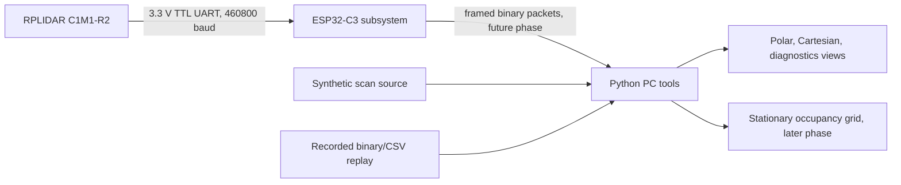

# SUPERSEDED HISTORICAL COPY

This nested document is not current authoritative guidance. Use the repository-root `README.md`, `PROJECT_SPEC.md`, `HARDWARE_LOCK.md`, `AGENTS.md`, and `docs/` files for the Phase 2.4 plan. Historical statements below may describe earlier single-C1 or Phase 0 assumptions.

# RPLIDAR C1 Subsystem

Maintainable LiDAR subsystem for the Mars Scout Rover undergraduate engineering project. The subsystem targets safe PC-direct verification, ESP32-C3 communication, deterministic replay, visualization, and later stationary occupancy-grid mapping for an RPLIDAR C1M1-R2.

Phase 0 is documentation, repository structure, configuration, and a PC-side synthetic scan interface only. Live LiDAR communication is not implemented in this phase.

## Verified Hardware

- LiDAR: SLAMTEC RPLIDAR C1M1-R2.
- Connector: XH2.54-5P housing, four active conductors and one unused position.
- Interface: 3.3 V TTL UART, 460800 baud, 8 data bits, no parity, 1 stop bit.
- Power: regulated 5.0 V supply, 4.8 V to 5.2 V allowed.
- Startup current: approximately 800 mA.
- Typical operating current: approximately 230 mA at 10 Hz.
- Maximum normal operating current: approximately 260 mA.
- Maximum specified supply ripple: 150 mV.
- Motor control: internal closed-loop motor control. There is no external motor PWM conductor.

Do not connect the LiDAR red wire to the ESP32 3.3 V pin.

## Architecture



The project separates hardware access, binary protocol parsing, scan assembly, filtering, coordinate conversion, transport, visualization, recording, replay, and mapping. Live serial input and replay input are designed to feed the same downstream scan interfaces.

## Quick Start

From this directory:

```powershell
cd rplidar_c1_subsystem
python -m venv .venv
.\\.venv\\Scripts\\Activate.ps1
pip install -e .\\pc
pytest .\\pc\\tests
```

The Phase 0 tests require no LiDAR hardware.

## PC-Direct Test Instructions

PC-direct verification is Phase 1. The intended hardware path is:

```text
RPLIDAR C1M1-R2 -> original XH2.54 cable -> supplied USB adapter -> PC
```

Planned Phase 1 steps:

1. List serial ports.
2. Open the selected port at 460800 baud.
3. Use the official SLAMTEC SDK or compatible software.
4. Read device information and health.
5. Start scanning, count points and rotations, save one full scan, stop cleanly.

No PC-direct live probe is implemented in Phase 0.

## ESP32 Build Instructions

Firmware is planned for PlatformIO with the Arduino framework on ESP32-C3 SuperMini. GPIO values are intentionally unset until the physical board labels and board documentation are checked.

Future build command:

```powershell
cd rplidar_c1_subsystem\\firmware
pio run
```

The firmware configuration must define verified LiDAR RX and TX pins before a hardware build can proceed.

## Python Installation

```powershell
cd rplidar_c1_subsystem
python -m venv .venv
.\\.venv\\Scripts\\Activate.ps1
pip install -e .\\pc
```

Python 3.11 or newer is expected.

## Live View

Live polar, Cartesian, and diagnostics views are planned for later phases. Phase 0 includes only the synthetic scan interface used by later visualization code.

## Record And Replay

Recording and deterministic replay are planned for later phases. The recording directory layout and metadata responsibilities are documented in [docs/recording_format.md](docs/recording_format.md).

## Current Implementation Status

- Phase 0: in progress in this repository.
- Repository skeleton: present.
- Documentation: present for hardware, wiring, architecture, coordinate frames, and test planning.
- Python synthetic scan source: present and covered by tests.
- Live LiDAR communication: not implemented.
- C1 binary protocol parser: not implemented.
- ESP32 UART command layer: not implemented.

## Known Limitations

- ESP32 UART pins are not selected yet.
- Power-supply model and physical wiring verification date are not recorded yet.
- Device firmware version, hardware revision, and redacted serial identifier are not recorded yet.
- PC-direct verification has not been completed.
- No live serial port is opened by Phase 0 code.
